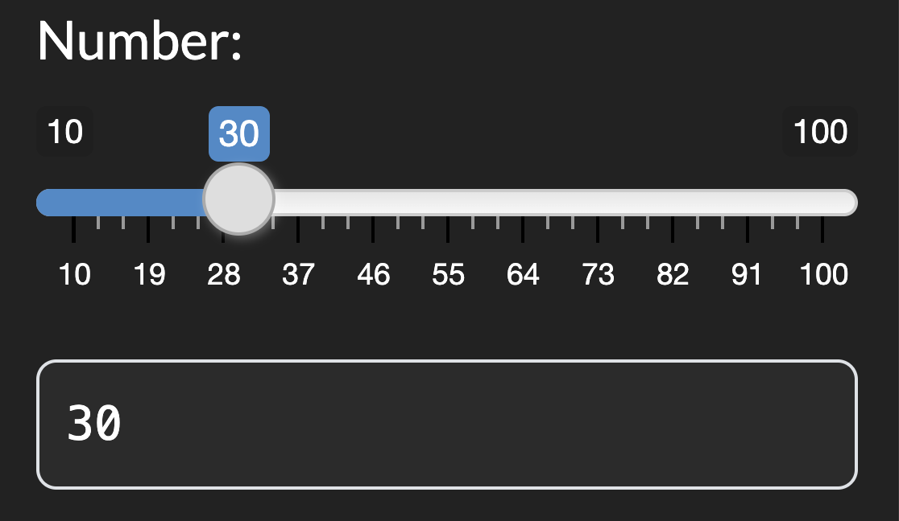

# shinyswatch

[Bootswatch](https://bootswatch.com/) + Bootstrap 5 themes for [Shiny](https://shiny.rstudio.com/py/).

## Installation

```sh
pip install shinyswatch
```

To install the latest development version from this repository:

```sh
pip install https://github.com/rstudio/py-shinyswatch/tarball/main
```

## Usage

Add your theme within your App's top level UI defintion. For example:

```python
# File: app.py
from shiny import App, Inputs, Outputs, Session, render, ui

import shinyswatch

app_ui = ui.page_fluid(
    # Theme code - start
    shinyswatch.theme.darkly(),
    # Theme code - end
    ui.input_slider("num", "Number:", min=10, max=100, value=30),
    ui.output_text_verbatim("slider_val"),
)


def server(input: Inputs, output: Outputs, session: Session):
    @output
    @render.text
    def slider_val():
        return f"{input.num()}"


app = App(app_ui, server)
```



## Examples

There are two examples in the shinyswatch repo.

<!-- You can view them online at: [shinyswatch.theme.darkly](http://rstudio.github.io/py-shinyswatch/reference/theme.darkly.html) and [get_theme](http://rstudio.github.io/py-shinyswatch/reference/get_theme.html). -->

To run the demos locally, you can clone the repo and run the examples by calling:

```sh
python3 -m shiny run examples/basic-darkly/app.py
# or
python3 -m shiny run examples/big-sketchy/app.py
```

## Development

If you want to do development on shinyswatch for Python:

```sh
pip install -e ".[dev,test]"
```
